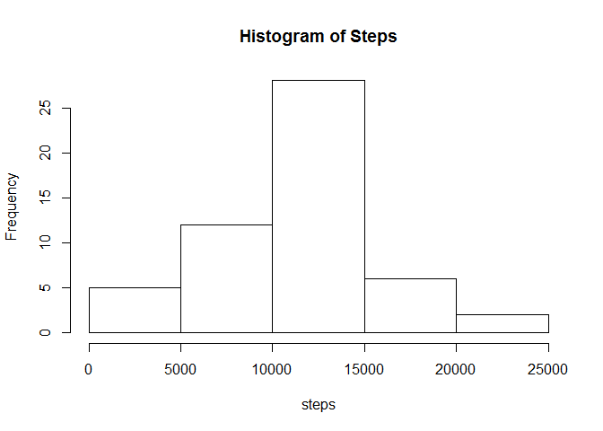
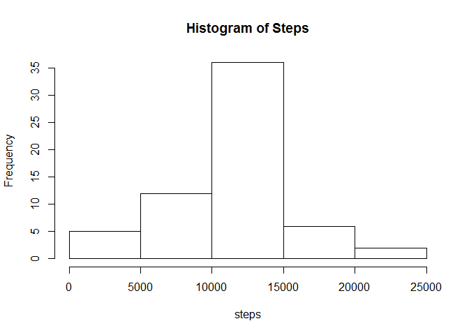
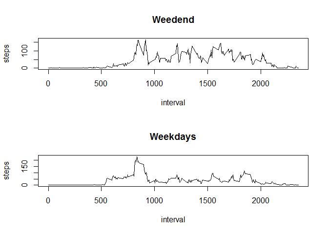

# Reproducible Research: Peer Assessment 1


## Loading and preprocessing the data


```r
#setwd('C:/Users/eugenia/Documents/GitHub/RepData_PeerAssessment1/')
#if (!file.exists('./data')) {dir.create('./data')}
#download.file(url= 'http://d396qusza40orc.cloudfront.net/repdata%2Fdata%2Factivity.zip', destfile = './data/activity.zip')
#unzip(zipfile = './data/activity.zip', exdir = './data')
data <- read.csv('./data/activity.csv', header = T)
#head(data)
data$interval <- as.character(data$interval)
data$date <- as.Date(as.character(data$date))
```

## What is mean total number of steps taken per day?

Create a new data set summarized by date, anaylize histogram, calculate mean and median


```r
library(data.table)
data <- data.table(data)
data_by_day <- data[, sum(steps), by=date]
#head(data_by_day)
with(data_by_day, hist(V1, xlab = 'steps', main = 'Histogram of Steps'))
```

 

```r
mean_steps <- mean(data_by_day$V1, na.rm = T)
median_steps <- median(data_by_day$V1, na.rm = T)
```

- The mean number of steps per day is 1.0766189\times 10^{4}  
- The median number of steps per day is 10765


## What is the average daily activity pattern?

Look at a line plot to visualize average step activity withing times of day


```r
data_by_int <- data[,mean(steps, na.rm = T),by = interval]
with(data_by_int, plot(interval, V1, type = 'l', ylab='steps'))
```

 

```r
max_interval <- subset(data_by_int, data_by_int$V1 == max(data_by_int$V1, na.rm = T))[[1]]
```

The largest number of steps on average across all days occurs at time interval 835


## Imputing missing values


```r
number_missing <- nrow(data[is.na(data$steps)])
```
There are 2304 missing values in the original dataset

### Filling missing values
The missing value for a time interval is assumed to be equal to the mean of non-missing value for that time interval

```r
missing <- data[is.na(data$steps)]
data$steps <- as.numeric(data$steps)
i=1
while (i<= nrow(missing)){
        data[data$interval == missing[i,]$interval & data$date == missing[i,]$date,]$steps <- data_by_int[data_by_int$interval == missing[i,]$interval, ]$V1
        i<- i+1}
```
### Re-calculating mean and median of number of steps per day


```r
data_by_day <- data[, sum(steps), by=date]
with(data_by_day, hist(V1, xlab = 'steps', main = 'Histogram of Steps'))
```

 

```r
mean_steps <- mean(data_by_day$V1)
median_steps <- median(data_by_day$V1)
```
The new mean is 1.0766189\times 10^{4}. The new median is 1.0766189\times 10^{4}.
There is almost no difference in mean and median after fulfilling missing values with means for time intervals.


## Are there differences in activity patterns between weekdays and weekends?

Create time series plots to analyse the difference between weekdays and weekends:

```r
data$weekdays <- weekdays(data$date)
data[data$weekdays %in% c( 'Saturday','Sunday'),]$weekdays <- 'Weekend'
data[data$weekdays != 'Weekend',]$weekdays <- 'Weekday'
par(mfrow = c(2,1))
with(data[data$weekdays == 'Weekend',mean(steps), by=interval], plot(interval, V1, type = 'l', main = 'Weedend', ylab = 'steps'))
with(data[data$weekdays == 'Weekday', mean(steps), by = interval], plot(interval, V1, type = 'l', main = 'Weekdays', ylab = 'steps'))
```

 
  
  On average more steps are walked on the weekends than on weekdays.


